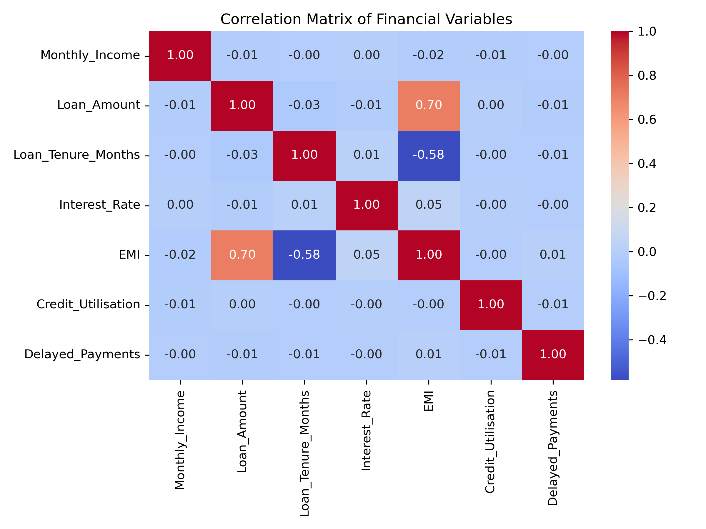
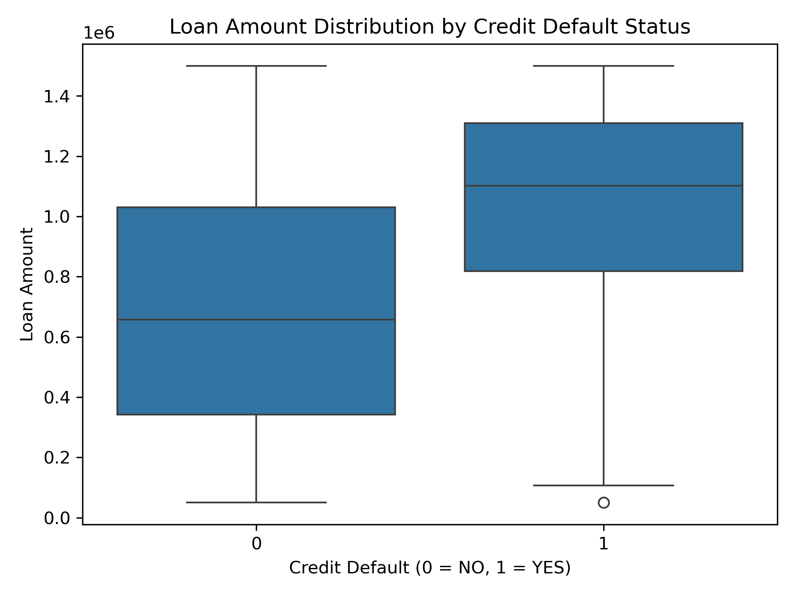
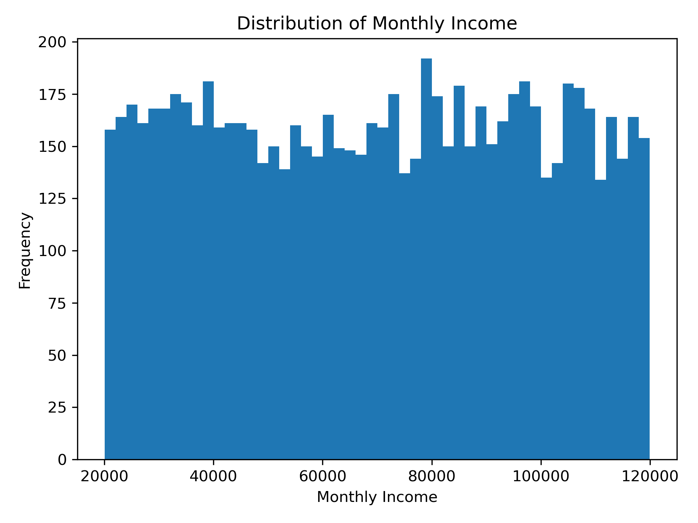

# Customer Behaviour & Credit Default Risk Analytics

## Project Overview

This project analyzes customer loan data to identify the key factors influencing credit default risk using Python. Through exploratory data analysis, statistical techniques, and data visualization, the project provides actionable insights that can support better lending decisions and risk assessment.

---

## Objectives

- Analyze customer loan behaviour
- Identify factors contributing to loan default
- Explore relationships between financial variables
- Generate business insights using data analytics

---

## Dataset

- Records: 8,000+ customer loan records
- Format: Excel (.xlsx)

---

## Tools & Technologies

- Python
- Pandas
- NumPy
- Matplotlib
- Jupyter Notebook

---

## Analysis Performed

- Data Cleaning
- Exploratory Data Analysis (EDA)
- Correlation Analysis
- Regression Analysis
- Time-Series Analysis
- Data Visualization

---

## Key Insights

- Higher EMI burden increases the likelihood of default.
- Loan amount and EMI show a positive relationship.
- Customer financial behaviour significantly impacts credit risk.
- Data visualization helped identify important trends and patterns.

---

---

# Project Visualizations

## Correlation Heatmap

This heatmap illustrates the relationships between key financial variables, helping identify factors associated with credit default.

---

## Loan Amount by Credit Default

This box plot compares the distribution of loan amounts for customers who defaulted versus those who did not.

---

## Monthly Income Distribution

This histogram shows how customer monthly income is distributed across the dataset.

---

## Repository Contents

| File | Description |
|------|-------------|
| Capstone_Analytics.ipynb | Complete Python analysis |
| credit_analytics_capstone_dataset.xlsx | Dataset used for analysis |
| Capstone_Reports.pdf | Final project report |

---

## Future Improvements

- Build machine learning models for default prediction.
- Develop an interactive Power BI dashboard.
- Deploy the analysis as a web application.

---

## Author

**Vyomakesh B S**

BBA Graduate | Finance & Data Analytics | Python | SQL | Excel
